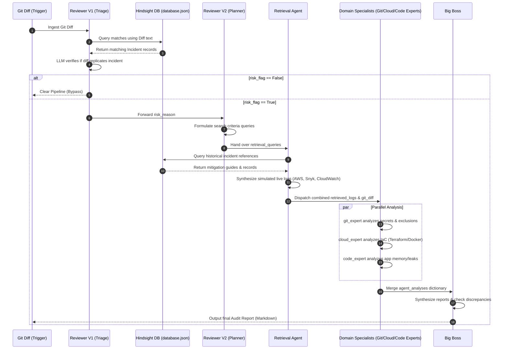

# Synthetic Data Retrieval & Utilization in the DevOps Pipeline Agent

This document explains how synthetic data (historical incidents and simulated system telemetry) is retrieved, formatted, and utilized across the multi-agent LangGraph workflow. 

---

## 1. The Synthetic Data Sources

The MVP utilizes two classes of synthetic data:
1.  **Historical DevOps Outages (Hindsight Memory):** Defined statically in [database.json](file:///c:/Users/sarim/OneDrive/Desktop/Projects%20(masir)/hackathon/devops_pipeline_agent/database.json). It maps structural faults (e.g., exposed SSH ports, connection leaks, committed keys) to their symptoms and mitigations.
2.  **Live Telemetry Logs (Simulated Runtime Logs):** Synthetically generated on-the-fly by the [retrieval_agent.py](file:///c:/Users/sarim/OneDrive/Desktop/Projects%20(masir)/hackathon/devops_pipeline_agent/agents/retrieval_agent.py) to simulate monitoring systems (e.g., AWS CloudTrail, CloudWatch logs, Trivy scanners).

---

## 2. Retrieval Mechanics (`HindsightDB`)

The [HindsightDB](file:///c:/Users/sarim/OneDrive/Desktop/Projects%20(masir)/hackathon/devops_pipeline_agent/hindsight_db.py) interface matches the incoming Git diff against historical incidents in [database.json](file:///c:/Users/sarim/OneDrive/Desktop/Projects%20(masir)/hackathon/devops_pipeline_agent/database.json) using a weighted, case-insensitive keyword and symptom matching algorithm:

### Weighted Scoring System
When a search query is executed, the query text is evaluated against three incident fields:

| Field | Weight | Description |
| :--- | :--- | :--- |
| **Title Exact/Substring** | `+5` / `+1` | Matches when the incident title or its terms appear in the query/diff. |
| **Symptoms List** | `+4` | Matches when specific error log templates or file structures match the query. |
| **Keywords List** | `+3` | Matches specific code tokens, e.g., `0.0.0.0/0`, `close`, `DATABASE_URL`. |

The incidents are sorted by score descending, and the top matching records are loaded into the graph state.

---

## 3. Data Lifecycle & Agentic Utilization Flow

The diagram below visualizes how synthetic data flows through the LangGraph architecture:



---

## 4. Node-by-Node Data Utilization

### Step 1: Ingestion & Vector Mapping (Reviewer V1)
*   **What it does:** `reviewer_v1` calls `db.query_incidents(git_diff)` to pull incidents.
*   **Utilization:** If an incident (like `INC-001` - unrestricted SSH port) has keywords (`0.0.0.0/0`, `port 22`) present in the Git diff, the database returns that incident. The LLM uses this data to decide if the diff poses a risk:
    > "Compare this diff with the historical Incident INC-001: Unrestricted Admin Access..."

### Step 2: Query Strategy Formulation (Reviewer V2)
*   **What it does:** If a risk is flagged, `reviewer_v2` reads the `risk_reason` and the `git_diff` and writes search queries.
*   **Utilization:** For a Terraform SSH risk, V2 outputs queries such as `["Terraform open SSH port 22", "compliance policy violation security group"]`.

### Step 3: Telemetry Context Gathering (Retrieval Agent)
*   **What it does:** `retrieval_agent` takes V2's queries and maps them to simulated tool outputs.
*   **Utilization:** If a query contains `ssh` or `security group`, the agent simulates an AWS CloudTrail compliance alert:
    ```json
    {
      "source": "AWS CloudTrail Audits",
      "type": "Compliance Guardrail Alert",
      "log_level": "WARNING",
      "message": "AWS security group rule modified by developer. Port 22 SSH ingress open to world.",
      "context": "Resource: sg-01c8a14ff2ba. Rule allows CIDR 0.0.0.0/0. Policy violation."
    }
    ```
    This simulated alert is appended to `state["retrieved_logs"]`.

### Step 4: Parallel Domain Assessment (Specialists)
The three specialists concurrently ingest the `git_diff` and the `retrieved_logs`:
*   **Git Expert:** Checks if files contain hardcoded variables found in secrets telemetry.
*   **Cloud Expert:** Takes the AWS CloudTrail / Docker container alerts and correlates them against the configuration files (`security.tf` / `Dockerfile`) in the diff to isolate security group violations or root user access risks.
*   **Code Expert:** Evaluates application code against error trace logs (e.g. `java.io.IOException: Too many open files`) to locate the exact unclosed socket or connection leak.

### Step 5: Synthesis (Big Boss)
*   **What it does:** `big_boss` receives markdown outputs from each expert inside `state["agent_analyses"]`.
*   **Utilization:** The LLM consolidates the separate specialist reports into a single executive summary. It translates raw logs into an engineering remediation checklist, including code patches, security policy adjustments, and a final release verdict.
